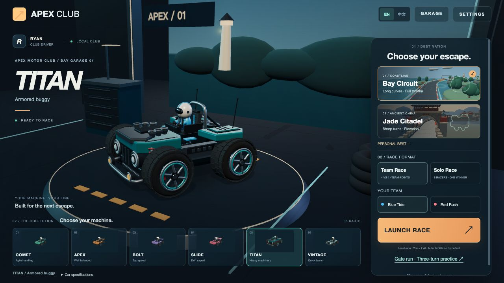
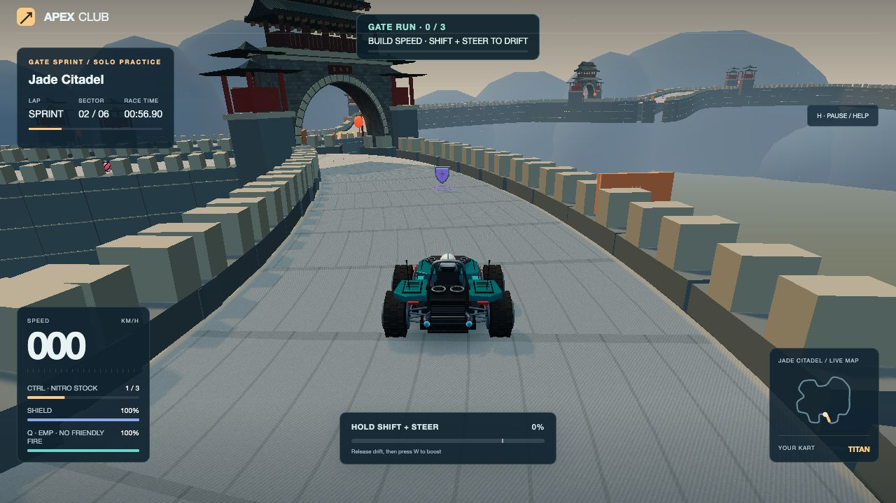
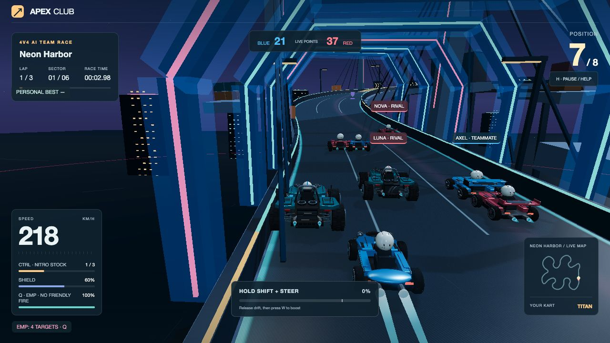
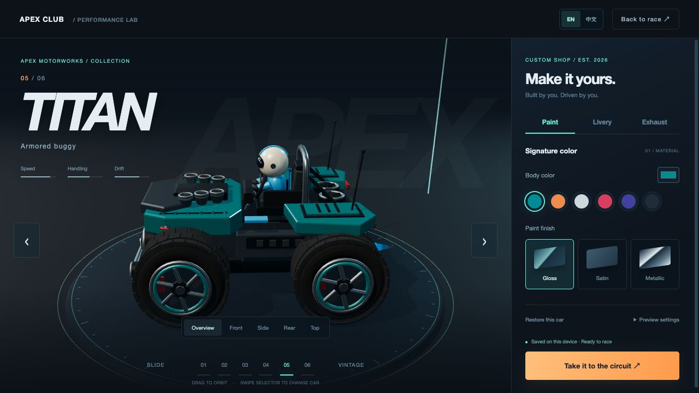

# APEX CLUB

**简体中文** · [English](README.en.md) · [日本語](README.ja.md) · [한국어](README.ko.md)

**六款赛车，三种世界。把下一个弯，变成你的超车机会。**

漂移竞速 · 车库改装 · 个人赛 / AI 组队赛

[**立即试玩 ↗**](https://apex-club-racing.vercel.app/) · [赛车与改装](#你的赛车你的风格) · [上手操作](#第一圈从这里开始)

APEX CLUB 是一款打开浏览器就能玩的 3D 街机赛车游戏。驾驶自己的赛车穿过海湾长弯、古城城门与霓虹港湾，在漂移中蓄力，抓住出弯、腾空和落地的时机，把一次小喷接成下一次超越。

无需下载客户端。游戏提供英文与中文界面，可在页面右上角切换。

## 三条赛道，三种节奏

**晴湾赛道 · Bay Circuit**

沿着海岸与桥梁加速，在开阔长弯里找准入弯线路。海面、岛屿与灯塔陪你跑完三圈。

**玉城古道 · Jade Citadel**

穿过城门，沿城墙驶向远山。连续弯道、高低起伏和金色跳台，让漂移与飞跃衔接起来。

**霓虹港湾 · Neon Harbor**

穿过霓虹拱廊，爬升到高架桥顶，再通过连续发卡弯、码头 S 弯和低位回转区。中央环形地标、桥塔拉索与港口吊机勾勒午夜天际线；急弯需要提前减速并规划漂移路线。

*截图来自当前开发版本，在线试玩的画面与功能可能随版本更新有所不同。*

## 你的赛车，你的风格

在车库左右切换座驾，转动视角欣赏车身，再为它选择车漆、拉花和尾焰。

| 赛车 | 驾驶个性 |
| --- | --- |
| **COMET** | 轻巧灵活，擅长快速变向 |
| **APEX** | 速度与操控均衡，适合第一场比赛 |
| **BOLT** | 偏重极速，入弯需要提前规划 |
| **SLIDE** | 漂移专精，蓄力更快 |
| **TITAN** | 宽轮距装甲越野车，夸张轮胎与外露悬挂 |
| **VINTAGE** | 经典圆灯造型，起步轻快 |

亮光、缎面、金属车漆，搭配双条纹或格纹涂装；再选一款喷射或脉冲尾焰。改装只改变外观，保留赛车原本的驾驶个性。选择会保存在当前浏览器，下次回来继续使用。

## 一个人争冠，也能为队伍得分

- **个人赛：** 与七位 AI 车手争夺三圈比赛的冠军。
- **4v4 组队赛：** 你与三位 AI 队友迎战四位 AI 对手，按完赛名次累计队伍积分。
- **练习：** 先从驾驶教学熟悉转向、刹车、漂移和小喷；当前开发版还提供独立的城门三弯挑战。

抓住机会释放 EMP，干扰附近对手，为超车创造空当；组队赛中不会伤到队友。也可以挑战自己的最佳圈速，与个人幽灵车较量，争取铜、银、金挑战奖牌。

*当前为单人游玩、AI 同场竞赛，暂不支持在线多人联机。*

**全球最快完赛榜：** 使用唯一车手名和密码注册、登录，按赛道和辅助驾驶设置查看三圈比赛的整场用时；无需邮箱。个人最佳单圈与幽灵车仍保存在浏览器。配置步骤见 [开发文档](docs/ONLINE-CLUB.md)。好友房计划在下一版本开发。

## 第一圈，从这里开始

选择赛车与赛道，点击 **Launch race / 开始比赛**。首次游玩可先完成驾驶教学。

默认开启自动油门，你负责转向和刹车。先练会一个动作：**按住 Shift 配合方向键漂移 → 蓄力后松开 Shift → 按 W 小喷。** 松开漂移本身不会自动喷射。

| 默认按键 | 操作 |
| --- | --- |
| **← / →** | 左右转向 |
| **↑ / ↓** | 油门 / 刹车；停下后继续按 ↓ 可倒车 |
| **Shift + 方向键** | 漂移；保持按住 Shift 可反打方向 |
| **W** | 触发已就绪的小喷、飞喷或落地喷 |
| **Ctrl** | 使用氮气 |
| **Q** | 释放 EMP |
| **H / Esc** | 暂停、查看操作说明或恢复车辆到赛道 |
| **R** | 重新开始比赛 |

在 **Settings → Custom hotkeys / 设置 → 自定义热键** 中更换按键。熟悉基础操作后，再试着把反打脱喷、飞喷和落地喷连起来。

**手机游玩：** 推荐横屏，使用屏幕上的方向、漂移、小喷、氮气、刹车、油门和 EMP 按钮。支持的设备还可以在手机操控设置中启用倾斜转向；触控方向键始终优先。传感器权限与全屏支持取决于设备和浏览器。

**按自己的节奏来：** 设置中可以开启新手辅助、减少镜头运动，调整画质和音量。卡住时先尝试刹车倒车，或暂停后选择恢复车辆到赛道。

---

**准备好下一圈了吗？**

[**进入 APEX CLUB ↗**](https://apex-club-racing.vercel.app/)

Created by **Ryan** · [反馈问题](https://github.com/Ryan-fm/apex-club-racing/issues) · [开发与本地运行](docs/DEVELOPMENT.md)

